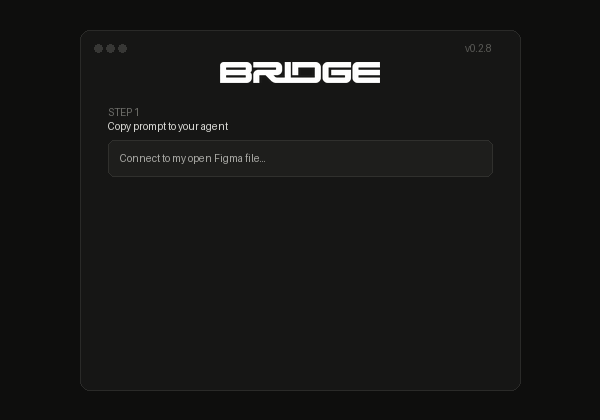

<p align="center">
  
</p>

<p align="center">
  
</p>

# Bridge

Bridge is a local, agent-grade Model Context Protocol (MCP) control plane for the live Figma Plugin API. It enables AI coding assistants and autonomous agents to inspect, reason about, render, and mutate the currently active Figma document in real time without requiring Figma Dev Mode, enterprise REST quotas, or external cloud parsers.

---

## Overview

Unlike standard REST integrations that query static snapshots on Figma servers, Bridge communicates directly with a live Figma Desktop session through an authenticated local loopback transport (`127.0.0.1:3874`). 

The open Figma document remains the single source of truth. Mutations and reads occur in the active document context, ensuring exact fidelity with Figma rendering, variables, components, styles, and vector networks.

---

## Key Features

- **Direct Live Inspection**: Query document structure, exact render bounds, styles, variables, typography runs, and components from the open Figma tab.
- **Visual Verification**: Export high-resolution rendered PNG, JPG, SVG, and PDF directly from Figma to verify visual changes before and after mutations.
- **Safe, Atomic Mutations**: Execute isolated and batch mutations with fingerprint assertions, rollback support, and an in-plugin hardware kill-switch.
- **Short-Lived Pairing Protocol**: Secure local pairing using one-time 6-digit OTP codes with replay protection and local master secret derivation.
- **Broad MCP Toolset**: 23 dedicated MCP tools spanning inspection, components, typography, layout, variables, styles, assets, prototype reactions, and version history.

---

## Architecture

Bridge consists of two lightweight components:

1. **Local MCP Server (`bridge/server.mjs`)**: A dependency-free Node.js stdio MCP server that exposes tools to AI clients and manages an authenticated loopback HTTP long-poll transport.
2. **Figma Desktop Plugin (`plugin/`)**: A local manifest plugin that runs in Figma Desktop, executes API operations within the Figma document sandbox, and streams results back to the local server.

```
+-------------------+             stdio              +----------------------+
|                   | <============================> |                      |
|     AI Agent      |   Model Context Protocol (MCP) |    Local Bridge      |
| (Antigravity/     |                                |    Node Server       |
|  Claude/Cursor/   |                                |  (127.0.0.1:3874)    |
|  Codex)           |                                +----------+-----------+
+-------------------+                                           ^
                                                                | HTTP Long-Poll
                                                                | (Authenticated)
                                                                v
                                                     +----------+-----------+
                                                     |                      |
                                                     |    Figma Desktop     |
                                                     |    Plugin Sandbox    |
                                                     |                      |
                                                     +----------------------+
```

---

## Prerequisites

- **Node.js**: Version 18.0.0 or higher.
- **Figma Desktop**: macOS or Windows application with Developer Mode enabled for local plugin loading.

---

## Installation and Quick Start

### 1. Load the Plugin in Figma Desktop

1. Open Figma Desktop.
2. Open any Figma design document.
3. Navigate to **Plugins** -> **Development** -> **Import plugin from manifest...**.
4. Select the `manifest.json` file inside this repository.
5. Run **Bridge** from your development plugins menu and keep the plugin window open.

### 2. Configure Your MCP Client

Add Bridge to your client configuration file.

#### Antigravity (`~/.gemini/config/mcp_config.json`)

```json
{
  "mcpServers": {
    "figma-agent-bridge": {
      "command": "node",
      "args": [
        "/ABSOLUTE/PATH/TO/bridge/bridge/server.mjs"
      ]
    }
  }
}
```

#### Claude Desktop (`~/Library/Application Support/Claude/claude_desktop_config.json`)

```json
{
  "mcpServers": {
    "figma-agent-bridge": {
      "command": "node",
      "args": [
        "/ABSOLUTE/PATH/TO/bridge/bridge/server.mjs"
      ]
    }
  }
}
```

#### Cursor (`~/.cursor/mcp.json`)

```json
{
  "mcpServers": {
    "figma-agent-bridge": {
      "command": "node",
      "args": [
        "/ABSOLUTE/PATH/TO/bridge/bridge/server.mjs"
      ]
    }
  }
}
```

---

## Pairing Workflow

1. Start your AI agent and send the initial connection prompt (available via the **Copy prompt** button in the plugin UI).
2. The agent will call `bridge_status` and return a fresh 6-digit pairing code.
3. Paste or type the 6-digit code into the first OTP box in the Figma plugin window.
4. The plugin authenticates with the local server, establishes an active session, and enables live document tools.

---

## Available MCP Tools

### Inspection and Context
- `bridge_status`: Returns daemon health, active pairing code, and connected file sessions.
- `bridge_doctor`: Diagnostic health check for transport and environment state.
- `figma_context`: Returns current file name, active page, selection, and viewport bounds.
- `figma_search`: Searches nodes on the current page or across all pages by name, type, or parent.
- `figma_inspect`: Performs deep inspection of node geometry, fills, strokes, effects, layout, and text segments.
- `figma_analyse`: Structural and statistical summary of subtrees, variants, and styles.
- `figma_recent_events`: Retrieves real-time selection and document modification events.

### Visual Verification
- `figma_snapshot`: Single round-trip returning node hierarchy data along with an authoritative Figma PNG render.
- `figma_render`: Exports authoritative PNG, JPG, SVG, PDF, or JSON_REST_V1 representations of target nodes.

### Mutations
- `figma_batch`: Atomic ordered mutations with rollback support and fingerprint verification.
- `figma_text`: Precise typography edits with style-preserving run modifications.
- `figma_components`: Component instance creation, swapping, overrides, variant switching, and detachment.
- `figma_variables`: Local variable creation, collection management, mode values, and bindings.
- `figma_styles`: Paint, text, effect, and grid style creation and updates.
- `figma_assets`: Image byte management and server-side URL asset imports.
- `figma_history`: Checkpoint commits, version requests, and undo operations.

### Design Systems and Dev Data
- `figma_library`: Published library variable and component discovery and import.
- `figma_fonts`: Font family listing, font weight searching, and async font loading.
- `figma_dev`: CSS code generation, measurements, and dev resource attachment.
- `figma_prototype`: Interactive prototype triggers, navigation, and reactions.
- `figma_motion`: Timeline animation and keyframe track operations.

### Extensibility
- `figma_capabilities`: Introspects available runtime methods in the active Figma client.
- `figma_invoke`: Controlled API method invocation (requires explicit user toggle in plugin UI).

---

## Security Model

- **Loopback Bound**: Network listener binds strictly to `127.0.0.1:3874`. No remote connections are accepted.
- **Isolated Token Derivation**: Every installation derives separate authorization tokens from a local random secret (`~/.figma-agent-bridge/secret.json`).
- **Short-Lived OTP**: Pairing codes expire after 15 minutes and invalidate immediately upon successful authentication.
- **Hardware Kill-Switch**: The plugin UI provides an instant toggle to pause all write permissions while preserving read access.
- **Unsafe Invocation Gate**: Dynamic method invocation is disabled by default and requires simultaneous agent opt-in and plugin UI authorization.

---

## Contributor

- **SirPrize** ([GitHub Profile](https://github.com/SirPrizeNZ))

---

## License

This project is licensed under the MIT License. See [LICENSE](LICENSE) for details.
